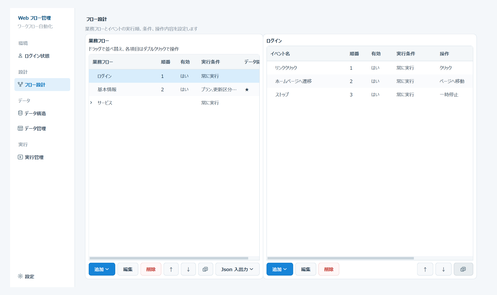

# Web フロー管理

Web フロー管理は、Google Chrome で行う定型作業を画面から登録し、Playwright で自動実行するデスクトップアプリです。プログラムを書かずに、ページ移動、クリック、文字入力、値の取得、ファイル送信などを組み合わせられます。



## 初めて利用する方へ

通常利用では、配布フォルダーにある `WebFlowManager.exe` を起動してください。初めて操作する場合は、先に次の手順書を開くことをおすすめします。

- [基本操作手順](操作手順書_ja/00_基本操作手順.html)：フロー作成から実行結果の確認まで
- [全体操作手順](操作手順書_ja/index.html)：各機能の概要と詳しい操作への入口

このアプリでは、次の順序で自動化を作成します。

1. 必要に応じてログイン状態を保存します。
2. 業務フローを作成します。
3. ブラウザー操作をイベントとして登録します。
4. 入力データが必要な場合は、データ構造と実行データを登録します。
5. 実行対象を確認し、業務フローを実行します。
6. 実行状況、ログ、エラー画像を確認します。

## 動作環境

- Windows
- Google Chrome
- 画面解像度 1180 × 720 以上
- ソースコードから起動する場合は Python 3.11 以降

アプリは端末にインストールされている Google Chrome を使用します。Chrome がない場合は、先にインストールしてください。

## 起動方法

### 配布版を起動する

1. `dist\WebFlowManager` フォルダーを任意の場所へ配置します。
2. `WebFlowManager.exe` をダブルクリックします。
3. 左側に「ログイン状態」「フロー設計」「データ構造」「データ管理」「実行管理」「設定」が表示されれば起動完了です。

`WebFlowManager.exe` と `_internal` フォルダーはワンセットです。実行ファイルだけを別の場所へ移動しないでください。

### ソースコードから起動する

PowerShell またはコマンドプロンプトで、プロジェクトフォルダー内から次を実行します。

```text
python -m venv env
env\Scripts\python.exe -m pip install -r requirements.txt
env\Scripts\python.exe main.py
```

端末にインストール済みの Chrome を使用するため、通常は `playwright install chromium` を実行する必要はありません。

## 最初に確認する設定

左側の「設定」を開き、次の項目を確認して「設定を保存」を押します。

- フォントと文字サイズ
- 表示言語
- 認証画面や要素選択画面で最初に開く URL
- 新規イベントの既定タイムアウト
- 同時に実行できるセッション数
- 実行時にブラウザーを表示するか

初回の動作確認では「実行時にブラウザーを表示」を有効にし、実行データを1件だけ選ぶと確認しやすくなります。

## 基本的な使い方

### 1. ログイン状態を準備する

対象サイトでログインが必要な場合は、「ログイン状態」で保存先を作成し、認証ブラウザーを開いてログインします。ログイン後に現在の状態を保存してください。

ログインが不要な場合は、この作業を省略できます。

### 2. 業務フローを作成する

「フロー設計」を開き、左側の「新規」を押します。名称、説明、有効状態、実行条件などを入力して保存します。

業務フローは処理のまとまりです。例えば「ログイン」「情報入力」「結果確認」のように分けると管理しやすくなります。

### 3. イベントを登録する

作成した業務フローを選択し、右側の「追加」から「イベント追加」を選びます。

- ページを開く：「ページへ移動」
- ボタンやリンクを押す：「クリック」
- 入力欄へ文字を入れる：「入力」
- 選択肢を選ぶ：「選択」
- 要素の表示、非表示、操作可能状態を待つ：「待機」
- キーを送る：「キー入力」
- 画面上の文字を取得する：「文字取得」
- スクリーンショットを保存する：「スクリーンショット」
- 指定時間待つ：「一時停止」
- ファイルを送信する：「ファイル送信」

クリックや入力などでは、「操作対象を選択」を押して Chrome を開き、F2 キーを押してから対象要素をクリックします。登録後は「このイベントを試す」で単独動作を確認できます。

スクリーンショットでは、1回目にスクリーンショット範囲、2回目に必要な場合だけスクロール領域を選択します。2回目は Esc で省略できます。指定した領域は縦横のスクロール位置を左上へ戻して画像を分割取得し、外枠を一度だけ残して結合します。成功確認対象が iframe 内にある場合は、「実行制御」タブの iframe パスも対象選択時に自動設定されます。

繰り返しや複数イベント単位の再実行が必要な場合は、「追加」から「グループ追加」を選びます。

### 4. 実行データを登録する

固定値だけで処理できる場合、この作業は省略できます。

データごとに入力内容を変える場合は、「データ構造」で項目を作成して保存し、「データ管理」で実行データと値を登録します。値の編集後は必ず「保存」を押してください。

データは JSON または Excel で入出力できます。Excel 読込は現在の全データを置き換えるため、必要なデータは事前に出力してください。

### 5. 業務フローを実行する

「実行管理」を開き、次を確認します。

- 使用するデータが「実行」になっている
- 使用しないデータが「スキップ」になっている
- 実行グループが正しい
- 同時セッション数が端末や対象サイトに対して多すぎない

確認後、「実行開始」を押します。現在の画面には実行途中の停止ボタンはありません。実行を中断するためアプリを閉じる場合は、表示される確認画面で判断してください。

### 6. 結果を確認する

「実行状況」では、現在処理中のデータ、業務フロー、イベントを確認できます。「ログ」では、完了、失敗、スキップ、再実行の内容を確認できます。

- ファイルログ：`log/`
- スクリーンショットとエラー画像：`artifacts/`

失敗した場合は、ログに表示されるエラー内容、失敗時の URL、エラー画像を確認してください。最初は実行データを1件に絞り、該当イベントの「直前まで実行」と「このイベントを試す」を使って確認すると原因を特定しやすくなります。

## 主な機能

- 複数の業務フローとイベントの登録、並べ替え、有効／無効の切り替え
- 画面からの操作対象選択と予備 locator の保存
- イベント、イベントグループ、業務フローへの実行条件設定
- 単一イベントとイベントグループの再実行
- 階層データやリストを使った繰り返し処理
- 実行データごとの実行／スキップと実行グループ設定
- 異なる実行グループの並列処理
- JSON と Excel によるデータ入出力
- 複数のログイン状態の保存と切り替え
- ブラウザー表示実行と非表示実行

## 操作手順書

- [全体操作手順](操作手順書_ja/index.html)
- [基本操作手順](操作手順書_ja/00_基本操作手順.html)
- [フロー設計画面](操作手順書_ja/01_メイン画面_操作手順.html)
- [イベント編集画面](操作手順書_ja/02_イベント編集画面_操作手順.html)
- [データ構造画面](操作手順書_ja/03_データ構造画面_操作手順.html)
- [データ管理画面](操作手順書_ja/04_データ管理画面_操作手順.html)
- [ログイン状態画面](操作手順書_ja/05_ログイン状態画面_操作手順.html)
- [実行管理画面](操作手順書_ja/06_実行管理画面_操作手順.html)
- [設定画面](操作手順書_ja/07_設定画面_操作手順.html)

## 保存場所とバックアップ

| パス | 内容 |
|---|---|
| `data/flows.db` | 業務フロー、イベント、データ構造、実行データ、アプリ設定 |
| `data/browser_state.json` | `default` のログイン状態 |
| `data/browser_states/*.json` | 名前を付けて保存したログイン状態 |
| `data/chrome_profiles/*/` | Cookie、サイト権限、証明書例外などを含む Chrome プロファイル |
| `log/` | 実行ログ |
| `artifacts/` | スクリーンショットとエラー画像 |

バックアップでは、少なくとも `data/flows.db` を保管してください。ログイン状態も引き継ぐ場合は、`data/browser_state.json`、`data/browser_states/`、`data/chrome_profiles/` も一緒に保管します。

## セキュリティ上の注意

- ログイン状態と Chrome プロファイルには Cookie、localStorage、サイト権限などが含まれます。第三者へ送付したり、公開リポジトリへ登録したりしないでください。
- 実行データ、ログ、スクリーンショットに個人情報や機密情報が含まれる場合があります。保存先と共有範囲を制限してください。
- 実行対象、入力値、送信先 URL を確認してから通常実行してください。

## 開発者向け情報

### Qt Designer による画面編集

画面とダイアログは `qt_ui/forms/` にあり、Qt Designer で `.ui` ファイルを直接編集できます。実行時に `qt_ui/ui_loader.py` が読み込むため、変更後に Python ファイルを生成する必要はありません。

- `main_window.ui`: メインウィンドウと左側ナビゲーション
- `flow_design.ui`: フロー設計画面
- `flow_editor.ui`: 業務フロー編集ダイアログ
- `event_editor.ui`: イベント編集ダイアログ
- `event_group.ui`: イベントグループ編集ダイアログ
- `guard_condition.ui`: 実行条件一覧ダイアログ
- `guard_rule.ui`: 実行条件編集ダイアログ
- `guard_dialog.ui`: JSON 形式の実行条件を編集する互換ダイアログ
- `data_path_picker.ui`: データ項目選択ダイアログ
- `auth.ui`: ログイン状態画面
- `schema.ui`: データ構造画面
- `field_dialog.ui`: フィールド編集ダイアログ
- `data.ui`: データ管理画面
- `record_dialog.ui`: 実行データ編集ダイアログ
- `execution.ui`: 実行管理画面
- `settings.ui`: 設定画面
- `confirmation.ui`: 共通確認ダイアログ

各ウィジェットの `objectName` は Python 側のコントローラーとの接続に使用します。`objectName` を変更する場合は、対応するコントローラー側の参照も変更してください。

### プロジェクト構成

```text
WebFlowManager/
├─ main.py                         # 起動入口
├─ i18n.py                         # 表示言語
├─ core/                           # データベース、実行処理、条件、Excel 入出力
├─ browser/                        # Chrome、要素選択、ログイン状態
├─ qt_ui/                          # PySide6 画面、Designer forms、共通 UI 部品
├─ locales/                        # 画面表示文言
├─ assets/                         # アプリケーションアイコン
├─ 操作手順書_ja/                   # 日本語操作手順書と画像
├─ data/                           # データベースとログイン状態
├─ log/                            # 実行ログ
└─ artifacts/                      # 実行結果とエラー画像
```
